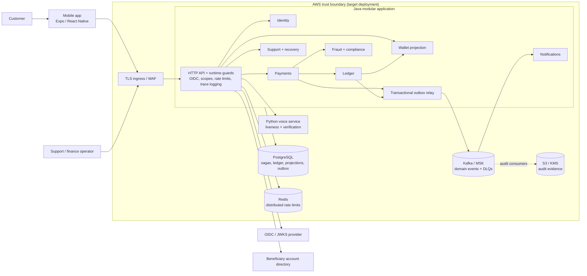
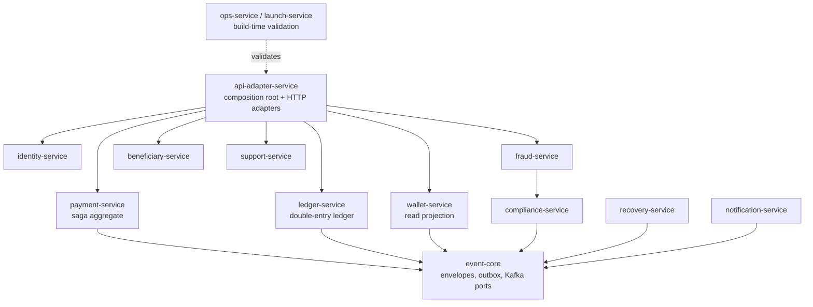
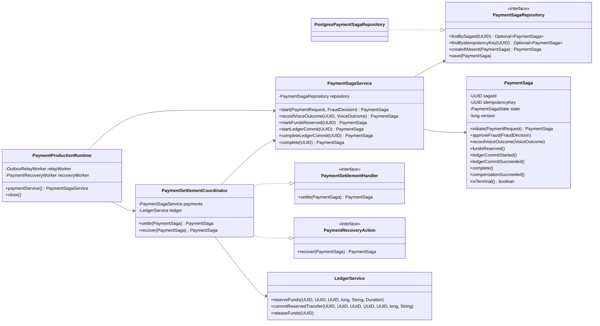
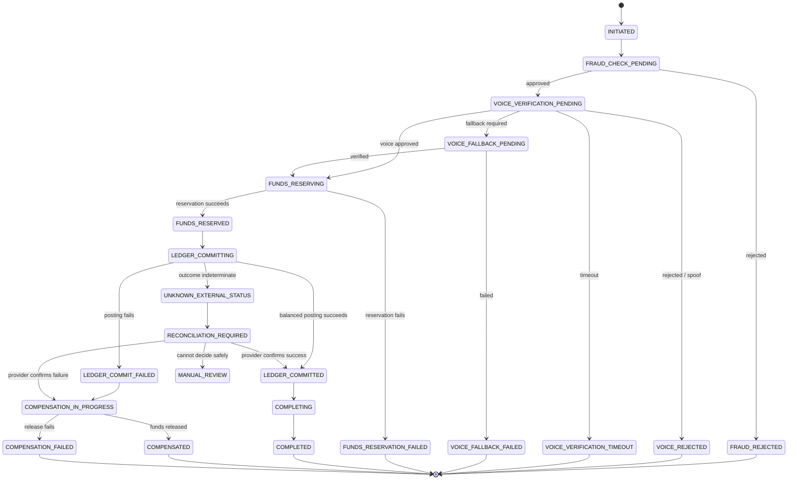

# Architecture and UML diagrams

Status: **as implemented in the repository**. VoiceSecure Wallet is an
engineering prototype, not an operationally validated production system.

These views deliberately distinguish deployable processes from Java modules.
The Java `*-service` modules are bounded contexts composed into one API
application; the Python voice runtime is a separate process.

## 1. System and deployment architecture

This is the primary architecture view for design reviews, threat modelling,
operations, and dependency ownership.



Key boundaries:

- The ledger is the source of financial truth; wallet balances are projections.
- The API derives customer identity from verified tokens. Request bodies are not
  trusted as an ownership source.
- Voice is an authorisation signal, never a balance or settlement authority.
- PostgreSQL transactions plus an outbox separate durable state change from
  asynchronous Kafka publication.
- `ops-service` and `launch-service` are policy/readiness validators, not
  production request-serving processes.

## 2. Java module dependency architecture

This view is useful for code ownership and architecture-boundary reviews.



The dependency direction should remain inward toward domain modules and ports.
Infrastructure adapters and runtime assembly belong at the application edge.

## 3. UML class diagram — payment settlement core

This is the highest-value static UML view because payment orchestration is the
system's consistency boundary.



## 4. UML state machine — durable payment saga

This view captures the legal lifecycle, terminal outcomes, compensation, and
operator-driven recovery states.



## 5. UML sequence — authorised payment with outbox delivery

This view highlights synchronous consistency decisions and the asynchronous
event boundary.

```mermaid
sequenceDiagram
    autonumber
    actor Customer
    participant Mobile
    participant API as API runtime
    participant IdP as OIDC / JWKS
    participant Fraud
    participant Voice
    participant Saga as Payment saga
    participant Ledger
    participant DB as PostgreSQL
    participant Relay as Outbox relay
    participant Kafka
    participant Consumer as Notification / projection

    Customer->>Mobile: Submit payment
    Mobile->>API: POST /v1/payments<br/>Bearer + trace + idempotency key
    API->>IdP: Verify token / resolve keys
    IdP-->>API: Trusted claims and scopes
    API->>Fraud: Assess amount, identity, velocity, compliance
    Fraud-->>API: Approved + voice policy
    API->>Saga: start(request, decision)
    Saga->>DB: createIfAbsent(idempotency key)
    DB-->>Saga: Durable saga
    Saga-->>API: VOICE_VERIFICATION_PENDING
    API-->>Mobile: Payment reference + challenge state

    Mobile->>API: Submit bound voice verification
    API->>Voice: Verify challenge, liveness, replay, match
    Voice-->>API: Approved outcome
    API->>Saga: recordVoiceOutcome()
    Saga->>DB: Persist FUNDS_RESERVING

    API->>Ledger: reserveFunds()
    Ledger->>DB: Durable reservation
    API->>Ledger: commitReservedTransfer()
    Ledger->>DB: Atomic balanced entries + outbox event
    DB-->>Ledger: Commit
    API->>Saga: completeLedgerCommit(); complete()
    Saga->>DB: Persist COMPLETED + payment outbox event
    API-->>Mobile: Completed receipt

    loop Poll pending outbox rows
        Relay->>DB: Claim pending events
        Relay->>Kafka: Publish keyed envelope
        Kafka-->>Relay: Acknowledge
        Relay->>DB: Mark published
    end
    Kafka-->>Consumer: Domain event
    Consumer->>Consumer: Idempotent handling by event ID
```

## Review rules

- Changes to deployment boundaries must update the system/deployment view and
  ADR-001.
- Changes to `PaymentSagaState` or transition methods must update the state
  machine and payment contract tests.
- New module dependencies must preserve the inward dependency direction and
  pass `quality/architecture-tests`.
- New asynchronous side effects must originate from durable outbox records and
  document retry, ordering, idempotency, and dead-letter behavior.
