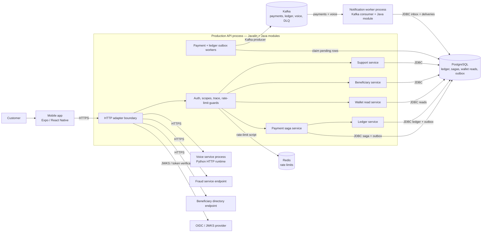
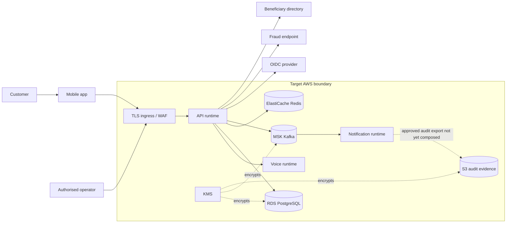
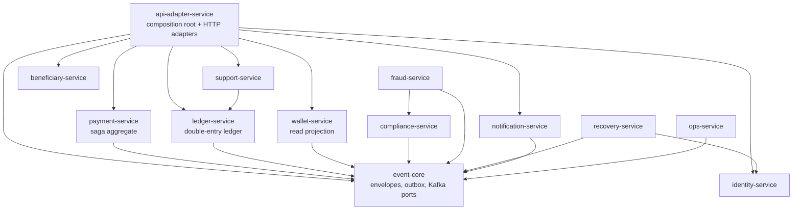
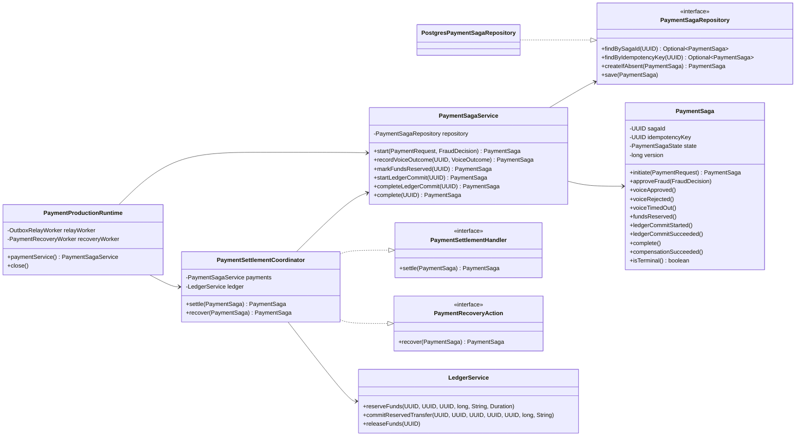
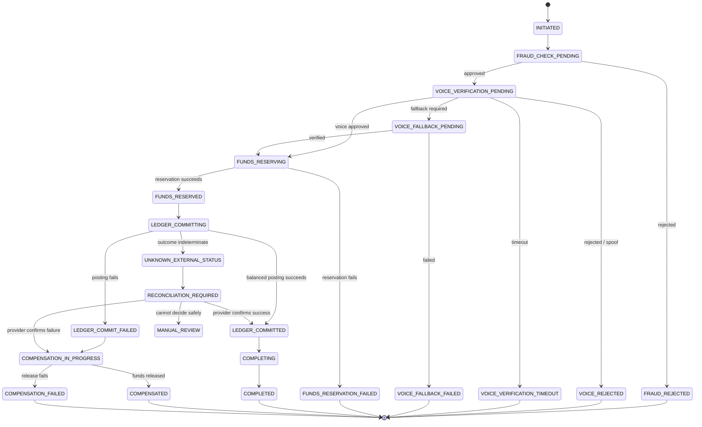
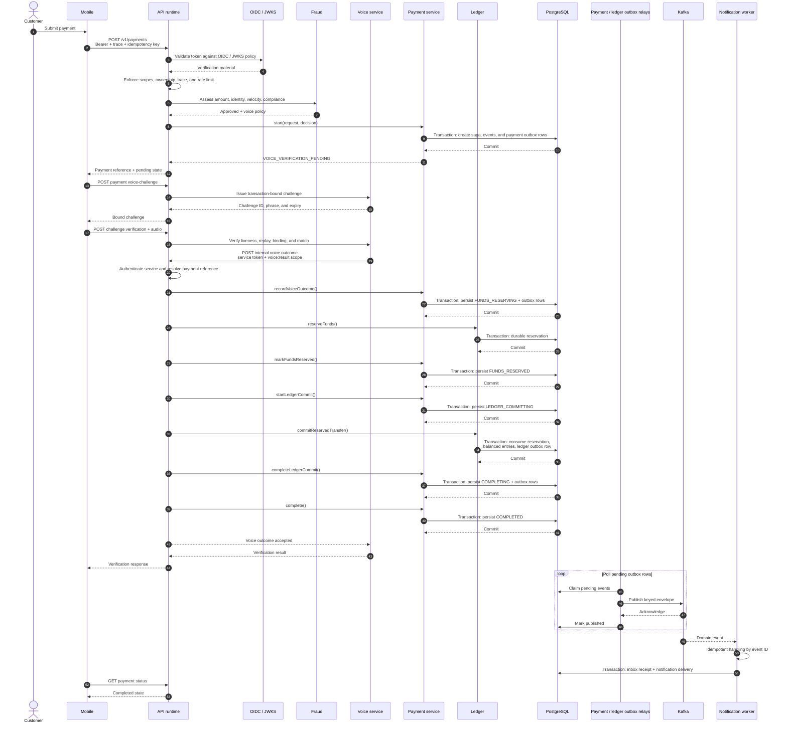

# Architecture and UML diagrams

Status: **repository implementation plus explicitly labelled target state**.
VoiceSecure Wallet is an engineering prototype, not an operationally validated
production system.

Evidence last reviewed: 2026-07-24. Reverify these views whenever a composition
root, module dependency, payment transition, or deployment boundary changes.

## 1. Current production runtime composition

Purpose: show process and protocol boundaries created by the checked-in
production composition roots. A class or Terraform resource existing in the
repository does not by itself establish a runtime connection.

```mermaid
flowchart LR
    Customer["Customer"]
    Mobile["Mobile app<br/>Expo / React Native"]
    Notify["Notification worker process<br/>Kafka consumer + Java module"]
    Voice["Voice service process<br/>Python HTTP runtime"]
    Fraud["Fraud service endpoint"]
    Directory["Beneficiary directory endpoint"]
    IdP["OIDC / JWKS provider"]
    DB[("PostgreSQL<br/>ledger, sagas, wallet reads, outbox")]
    Kafka[("Kafka<br/>payments, ledger, voice, DLQ")]
    Redis[("Redis<br/>rate limits")]

    subgraph APIProcess["Production API process — Javalin + Java modules"]
        HTTP["HTTP adapter boundary"]
        Guards["Auth, scopes, trace, rate-limit guards"]
        Payment["Payment saga service"]
        Ledger["Ledger service"]
        Wallet["Wallet read service"]
        Beneficiary["Beneficiary service"]
        Support["Support service"]
        Outbox["Payment + ledger outbox workers"]
    end

    Customer --> Mobile
    Mobile -->|HTTPS| HTTP
    HTTP --> Guards
    Guards --> Payment
    Guards --> Wallet
    Guards --> Beneficiary
    Guards --> Support
    Payment --> Ledger
    HTTP -->|HTTPS| Fraud
    HTTP -->|HTTPS| Voice
    HTTP -->|HTTPS| Directory
    HTTP -->|JWKS / token verification| IdP
    Guards -->|rate-limit script| Redis
    Payment -->|JDBC saga + outbox| DB
    Ledger -->|JDBC ledger + outbox| DB
    Wallet -->|JDBC reads| DB
    Beneficiary -->|JDBC| DB
    Support -->|JDBC| DB
    Outbox -->|claim pending rows| DB
    Outbox -->|Kafka producer| Kafka
    Kafka -->|payments + voice| Notify
    Notify -->|JDBC inbox + deliveries| DB
```

Current-state qualifications:

- The production API uses the external `HttpFraudDecisionProvider` and
  `HttpVoiceGatewayClient`; the repository's in-process fraud, compliance, and
  identity domain modules are not composed into `ProductionApiRuntime`.
- `ProductionNotificationRuntime` is a separate Kafka-consuming composition,
  not part of the request-serving API process.
- `WalletService` can apply ledger envelopes, but the checked-in production
  composition does not establish a Kafka-to-wallet projection consumer.
- The API derives customer identity from verified tokens. Request bodies are not
  trusted as an ownership source.
- Voice is an authorisation signal, never a balance or settlement authority.
- `ops-service` and `launch-service` are policy/readiness validators, not
  production request-serving processes.

## 2. Target AWS deployment

Purpose: record the intended infrastructure topology. Dashed relationships are
planned or require deployment evidence; this view must not be cited as proof of
a live environment.

```mermaid
flowchart LR
    Customer["Customer"] --> Mobile["Mobile app"]
    Operator["Authorised operator"] --> Edge["TLS ingress / WAF"]
    Mobile --> Edge

    subgraph AWS["Target AWS boundary"]
        Edge --> API["API runtime"]
        API --> Voice["Voice runtime"]
        API --> RDS[("RDS PostgreSQL")]
        API --> Redis[("ElastiCache Redis")]
        API --> MSK[("MSK Kafka")]
        MSK --> Notify["Notification runtime"]
        KMS["KMS"] -. encrypts .-> RDS
        KMS -. encrypts .-> MSK
        KMS -. encrypts .-> Audit[("S3 audit evidence")]
    end

    API --> IdP["OIDC provider"]
    API --> Fraud["Fraud endpoint"]
    API --> Directory["Beneficiary directory"]
    Notify -. approved audit export not yet composed .-> Audit
```

The S3 audit-export relationship remains explicitly unimplemented until a
named producer/consumer, event contract, ownership boundary, and deployment
evidence exist.

## 3. Compile-time Java module dependencies

Purpose: show selected direct Maven dependencies. Arrows mean “depends on at
compile time”; they do not imply an HTTP call, process boundary, or production
composition.

```mermaid
flowchart TB
    App["api-adapter-service<br/>composition root + HTTP adapters"]
    Payment["payment-service<br/>saga aggregate"]
    Ledger["ledger-service<br/>double-entry ledger"]
    Wallet["wallet-service<br/>read projection"]
    Identity["identity-service"]
    Fraud["fraud-service"]
    Compliance["compliance-service"]
    Beneficiary["beneficiary-service"]
    Support["support-service"]
    Recovery["recovery-service"]
    Notification["notification-service"]
    Events["event-core<br/>envelopes, outbox, Kafka ports"]
    Ops["ops-service"]

    App --> Payment
    App --> Ledger
    App --> Wallet
    App --> Identity
    App --> Beneficiary
    App --> Support
    App --> Notification
    App --> Events
    Payment --> Events
    Ledger --> Events
    Wallet --> Events
    Compliance --> Events
    Fraud --> Events
    Recovery --> Events
    Recovery --> Identity
    Notification --> Events
    Fraud --> Compliance
    Support --> Ledger
    Ops --> Events
```

`fraud-service` is not a direct compile-time dependency of
`api-adapter-service`; production reaches the fraud boundary through
`HttpFraudDecisionProvider`.

## 4. UML class diagram — payment settlement core

Purpose: document the classes that enforce the payment consistency boundary.

```mermaid
classDiagram
    direction LR

    class PaymentSaga {
        -UUID sagaId
        -UUID idempotencyKey
        -PaymentSagaState state
        -long version
        +initiate(PaymentRequest) PaymentSaga
        +approveFraud(FraudDecision)
        +voiceApproved()
        +voiceRejected()
        +voiceTimedOut()
        +fundsReserved()
        +ledgerCommitStarted()
        +ledgerCommitSucceeded()
        +complete()
        +compensationSucceeded()
        +isTerminal() boolean
    }

    class PaymentSagaService {
        -PaymentSagaRepository repository
        +start(PaymentRequest, FraudDecision) PaymentSaga
        +recordVoiceOutcome(UUID, VoiceOutcome) PaymentSaga
        +markFundsReserved(UUID) PaymentSaga
        +startLedgerCommit(UUID) PaymentSaga
        +completeLedgerCommit(UUID) PaymentSaga
        +complete(UUID) PaymentSaga
    }

    class PaymentSagaRepository {
        <<interface>>
        +findBySagaId(UUID) Optional~PaymentSaga~
        +findByIdempotencyKey(UUID) Optional~PaymentSaga~
        +createIfAbsent(PaymentSaga) PaymentSaga
        +save(PaymentSaga)
    }

    class PostgresPaymentSagaRepository
    class PaymentSettlementHandler {
        <<interface>>
        +settle(PaymentSaga) PaymentSaga
    }
    class PaymentRecoveryAction {
        <<interface>>
        +recover(PaymentSaga) PaymentSaga
    }
    class PaymentSettlementCoordinator {
        -PaymentSagaService payments
        -LedgerService ledger
        +settle(PaymentSaga) PaymentSaga
        +recover(PaymentSaga) PaymentSaga
    }
    class LedgerService {
        +reserveFunds(UUID, UUID, UUID, long, String, Duration)
        +commitReservedTransfer(UUID, UUID, UUID, UUID, UUID, long, String)
        +releaseFunds(UUID)
    }
    class PaymentProductionRuntime {
        -OutboxRelayWorker relayWorker
        -PaymentRecoveryWorker recoveryWorker
        +paymentService() PaymentSagaService
        +close()
    }

    PaymentSagaService --> PaymentSagaRepository
    PaymentSagaService --> PaymentSaga
    PostgresPaymentSagaRepository ..|> PaymentSagaRepository
    PaymentSettlementCoordinator ..|> PaymentSettlementHandler
    PaymentSettlementCoordinator ..|> PaymentRecoveryAction
    PaymentSettlementCoordinator --> PaymentSagaService
    PaymentSettlementCoordinator --> LedgerService
    PaymentProductionRuntime --> PaymentSagaService
    PaymentProductionRuntime --> PaymentSettlementCoordinator
```

## 5. UML state machine — durable payment saga

Purpose: capture the legal aggregate transitions, terminal outcomes,
compensation, and operator-driven recovery states.

```mermaid
stateDiagram-v2
    [*] --> INITIATED
    INITIATED --> FRAUD_CHECK_PENDING
    FRAUD_CHECK_PENDING --> FRAUD_REJECTED: rejected
    FRAUD_CHECK_PENDING --> VOICE_VERIFICATION_PENDING: approved

    VOICE_VERIFICATION_PENDING --> FUNDS_RESERVING: voice approved
    VOICE_VERIFICATION_PENDING --> VOICE_REJECTED: rejected / spoof
    VOICE_VERIFICATION_PENDING --> VOICE_VERIFICATION_TIMEOUT: timeout
    VOICE_VERIFICATION_PENDING --> VOICE_FALLBACK_PENDING: fallback required
    VOICE_FALLBACK_PENDING --> FUNDS_RESERVING: verified
    VOICE_FALLBACK_PENDING --> VOICE_FALLBACK_FAILED: failed

    FUNDS_RESERVING --> FUNDS_RESERVED: reservation succeeds
    FUNDS_RESERVING --> FUNDS_RESERVATION_FAILED: reservation fails
    FUNDS_RESERVED --> LEDGER_COMMITTING
    LEDGER_COMMITTING --> LEDGER_COMMITTED: balanced posting succeeds
    LEDGER_COMMITTING --> LEDGER_COMMIT_FAILED: posting fails
    LEDGER_COMMITTING --> UNKNOWN_EXTERNAL_STATUS: outcome indeterminate
    LEDGER_COMMITTED --> COMPLETING
    COMPLETING --> COMPLETED

    LEDGER_COMMIT_FAILED --> COMPENSATION_IN_PROGRESS
    COMPENSATION_IN_PROGRESS --> COMPENSATED: funds released
    COMPENSATION_IN_PROGRESS --> COMPENSATION_FAILED: release fails

    UNKNOWN_EXTERNAL_STATUS --> RECONCILIATION_REQUIRED
    RECONCILIATION_REQUIRED --> LEDGER_COMMITTED: provider confirms success
    RECONCILIATION_REQUIRED --> COMPENSATION_IN_PROGRESS: provider confirms failure
    RECONCILIATION_REQUIRED --> MANUAL_REVIEW: cannot decide safely

    FRAUD_REJECTED --> [*]
    VOICE_REJECTED --> [*]
    VOICE_VERIFICATION_TIMEOUT --> [*]
    VOICE_FALLBACK_FAILED --> [*]
    FUNDS_RESERVATION_FAILED --> [*]
    COMPLETED --> [*]
    COMPENSATED --> [*]
    COMPENSATION_FAILED --> [*]
```

## 6. UML sequence — authorised payment with outbox delivery

Purpose: distinguish customer calls, service-to-service trust, database
transactions, and asynchronous event publication.

```mermaid
sequenceDiagram
    autonumber
    actor Customer
    participant Mobile
    participant API as API runtime
    participant IdP as OIDC / JWKS
    participant Fraud
    participant Voice as Voice service
    participant Saga as Payment service
    participant Ledger
    participant DB as PostgreSQL
    participant Relay as Payment / ledger outbox relays
    participant Kafka
    participant Consumer as Notification worker

    Customer->>Mobile: Submit payment
    Mobile->>API: POST /v1/payments<br/>Bearer + trace + idempotency key
    API->>IdP: Validate token against OIDC / JWKS policy
    IdP-->>API: Verification material
    API->>API: Enforce scopes, ownership, trace, and rate limit
    API->>Fraud: Assess amount, identity, velocity, compliance
    Fraud-->>API: Approved + voice policy
    API->>Saga: start(request, decision)
    Saga->>DB: Transaction: create saga, events, and payment outbox rows
    DB-->>Saga: Commit
    Saga-->>API: VOICE_VERIFICATION_PENDING
    API-->>Mobile: Payment reference + pending state

    Mobile->>API: POST payment voice-challenge
    API->>Voice: Issue transaction-bound challenge
    Voice-->>API: Challenge ID, phrase, and expiry
    API-->>Mobile: Bound challenge
    Mobile->>API: POST challenge verification + audio
    API->>Voice: Verify liveness, replay, binding, and match

    Voice->>API: POST internal voice outcome<br/>service token + voice:result scope
    API->>API: Authenticate service and resolve payment reference
    API->>Saga: recordVoiceOutcome()
    Saga->>DB: Transaction: persist FUNDS_RESERVING + outbox rows
    DB-->>Saga: Commit

    API->>Ledger: reserveFunds()
    Ledger->>DB: Transaction: durable reservation
    DB-->>Ledger: Commit
    API->>Saga: markFundsReserved()
    Saga->>DB: Transaction: persist FUNDS_RESERVED
    DB-->>Saga: Commit
    API->>Saga: startLedgerCommit()
    Saga->>DB: Transaction: persist LEDGER_COMMITTING
    DB-->>Saga: Commit
    API->>Ledger: commitReservedTransfer()
    Ledger->>DB: Transaction: consume reservation,<br/>balanced entries, ledger outbox row
    DB-->>Ledger: Commit
    API->>Saga: completeLedgerCommit()
    Saga->>DB: Transaction: persist COMPLETING + outbox rows
    DB-->>Saga: Commit
    API->>Saga: complete()
    Saga->>DB: Transaction: persist COMPLETED
    DB-->>Saga: Commit
    API-->>Voice: Voice outcome accepted
    Voice-->>API: Verification result
    API-->>Mobile: Verification response

    loop Poll pending outbox rows
        Relay->>DB: Claim pending events
        Relay->>Kafka: Publish keyed envelope
        Kafka-->>Relay: Acknowledge
        Relay->>DB: Mark published
    end
    Kafka-->>Consumer: Domain event
    Consumer->>Consumer: Idempotent handling by event ID
    Consumer->>DB: Transaction: inbox receipt + notification delivery

    Mobile->>API: GET payment status
    API-->>Mobile: Completed state
```

## Review rules

- Changes to deployment boundaries must update the system/deployment view and
  ADR-001.
- Changes to `PaymentSagaState` or transition methods must update the state
  machine and payment contract tests.
- New module dependencies must preserve the inward dependency direction and
  pass `quality/architecture-tests`.
- New asynchronous side effects must originate from durable outbox records and
  document retry, ordering, idempotency, and dead-letter behavior.

## Evidence map

| Claim | Authoritative repository evidence |
| --- | --- |
| Production API composition and remote dependencies | `ProductionApiRuntime`, `PaymentApiAdapter`, `VoiceGatewayApiAdapter` |
| Separate notification process and Kafka topics | `ProductionNotificationRuntime`, `KafkaNotificationConsumer` |
| Voice verification callback trust boundary | `voice_service/http_runtime.py`, `PaymentApiAdapter.requiredScopes` |
| Direct Java module dependencies | Maven `pom.xml` files and `quality/architecture-tests` |
| Payment transitions | `PaymentSaga`, `PaymentSagaService`, `PaymentSagaState` |
| Saga/event/outbox atomic persistence | `PostgresPaymentSagaRepository` |
| Ledger reservation and balanced transfer | `LedgerService`, production ledger repository |
| Target AWS resources | `infra/aws` Terraform modules; deployment evidence remains separate |
