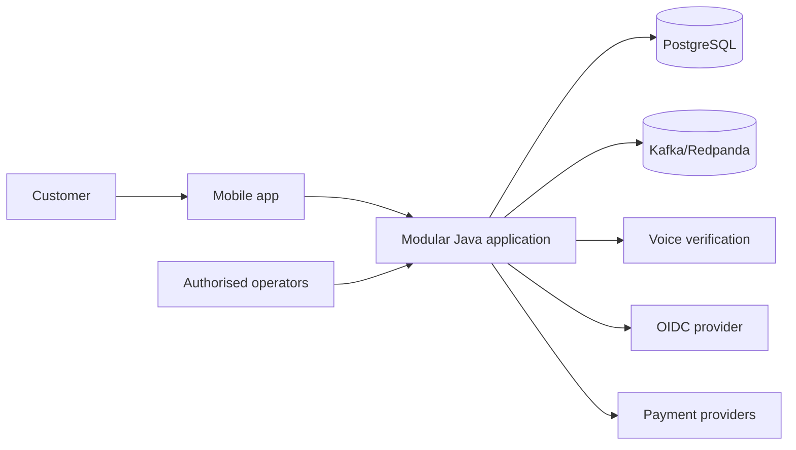

# Target container diagram

```mermaid
flowchart LR
  Customer --> Mobile[Mobile app]
  Mobile --> Java[Modular Java application]
  Java --> DB[(PostgreSQL)]
  Java --> Broker[(Kafka/Redpanda)]
  Java --> Voice[Voice verification]
  Java --> IdP[OIDC provider]
  Java --> Providers[Payment providers]
  Ops[Authorised operators] --> Java
```

