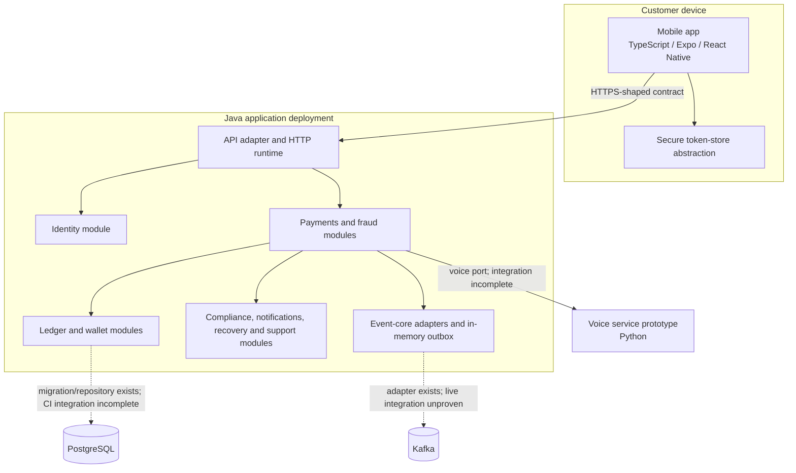

# Current container diagram

This diagram describes checked-in runtime reality, not the names of Maven modules.

Only the Java API adapter exposes a runtime entry point. The other Java reactor modules are libraries composed into that runtime. `ops-service` and `launch-service` are build-time policy validators. The Python voice module is a separately packaged prototype but has no checked-in deployment definition.

