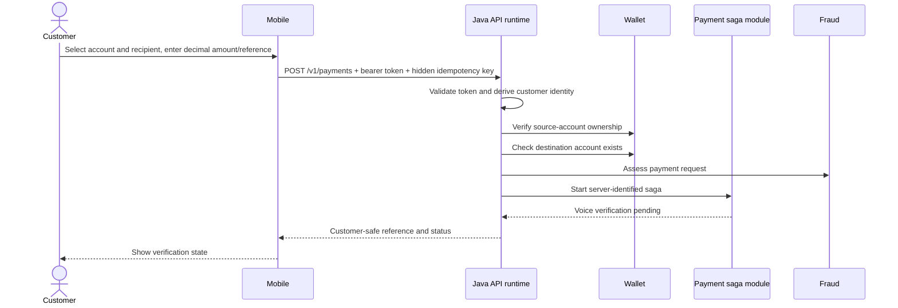

# Current payment flow

## Known gaps

- Accounts and recipients are currently seeded UI choices rather than loaded through `/v1/me` resources.
- A beneficiary aggregate and access policy are not yet implemented.
- The public request is not yet the target nested `Money` contract.
- Review, explicit authorisation, durable recovery and receipt screens are incomplete.
- Saga persistence, outbox and provider reconciliation exist only in partial/prototype form.
