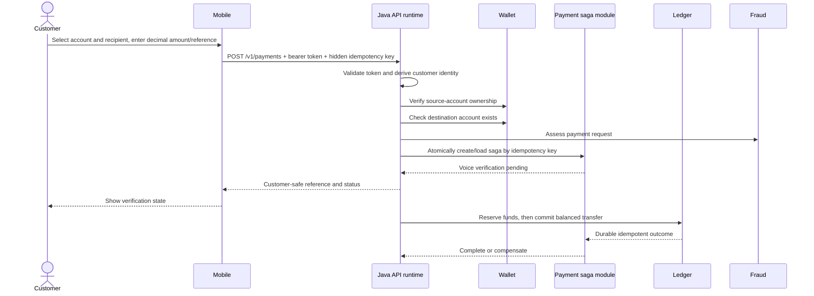

# Current payment flow

## Known gaps

- Mobile still needs physical-device validation for microphone, codecs,
  accessibility, secure storage and unreliable networks.
- Provider-specific reconciliation adapters and real settlement-file ingestion
  remain deployment integrations.
- The production recovery worker now resumes deterministic internal settlement
  states and routes unknown external outcomes to reconciliation; deployed
  multi-instance soak evidence is still required.
- Customer review, authorisation and receipt journeys need final device-level QA.
