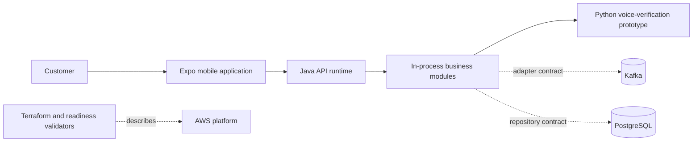

# Current system context

Status: **implemented prototype; not operationally validated**.

VoiceSecure Wallet currently consists of an Expo/React Native customer application, one Java HTTP runtime that composes Java business modules in-process, and a Python voice-verification prototype. PostgreSQL, Kafka, AWS infrastructure and production controls are represented by adapters, migrations, Terraform, validators or tests; the repository does not contain evidence of a live production deployment.

External actors are customers, support operators, fraud/compliance operators and finance operators. The latter three have domain concepts and policy tests but no complete operator user interface in this repository.

## Trust boundaries

- Access-token verification occurs at the Java API runtime.
- Customer identity is injected into an internal request context after verification.
- Account ownership must be enforced by application services, not request bodies.
- Voice output is an authorisation signal; it is not financial truth.
- The ledger is intended to be financial truth, although production persistence and reconciliation evidence remain incomplete.

