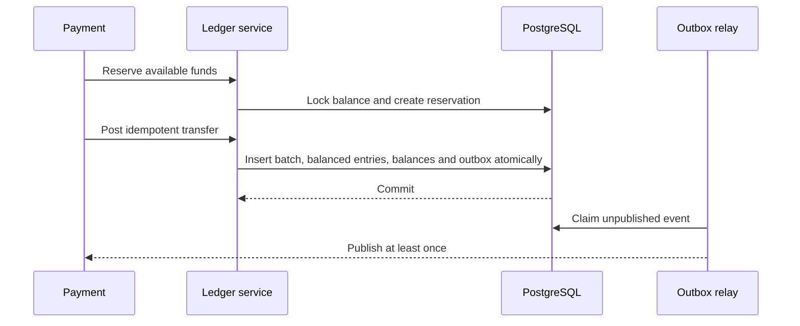

# Ledger sequence

```mermaid
sequenceDiagram
  participant P as Payment
  participant L as Ledger service
  participant D as PostgreSQL
  participant O as Outbox relay
  P->>L: Reserve available funds
  L->>D: Lock balance and create reservation
  P->>L: Post idempotent transfer
  L->>D: Insert batch, balanced entries, balances and outbox atomically
  D-->>L: Commit
  O->>D: Claim unpublished event
  O-->>P: Publish at least once
```

