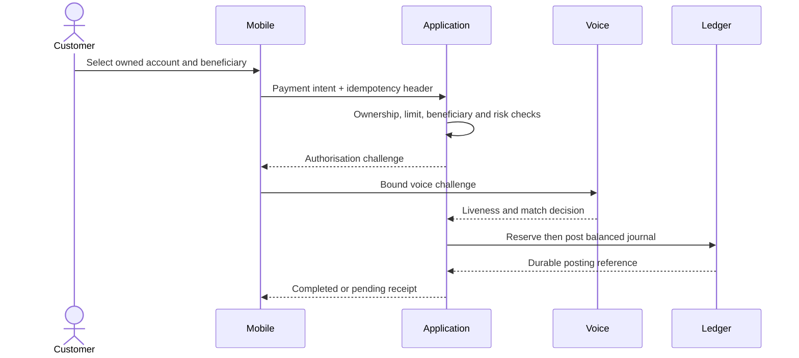

# Payment sequence

```mermaid
sequenceDiagram
  actor C as Customer
  participant M as Mobile
  participant A as Application
  participant V as Voice
  participant L as Ledger
  C->>M: Select owned account and beneficiary
  M->>A: Payment intent + idempotency header
  A->>A: Ownership, limit, beneficiary and risk checks
  A-->>M: Authorisation challenge
  M->>V: Bound voice challenge
  V-->>A: Liveness and match decision
  A->>L: Reserve then post balanced journal
  L-->>A: Durable posting reference
  A-->>M: Completed or pending receipt
```

