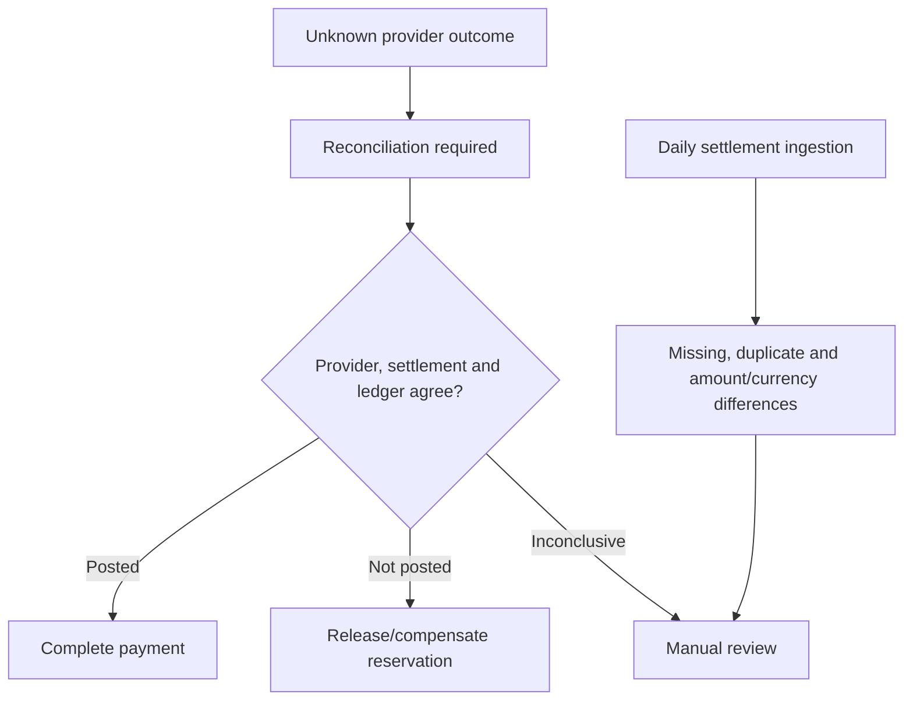

# Reconciliation flow

```mermaid
flowchart TD
  Unknown[Unknown provider outcome] --> Required[Reconciliation required]
  Required --> Match{Provider, settlement and ledger agree?}
  Match -->|Posted| Complete[Complete payment]
  Match -->|Not posted| Release[Release/compensate reservation]
  Match -->|Inconclusive| Manual[Manual review]
  Daily[Daily settlement ingestion] --> Differences[Missing, duplicate and amount/currency differences]
  Differences --> Manual
```

